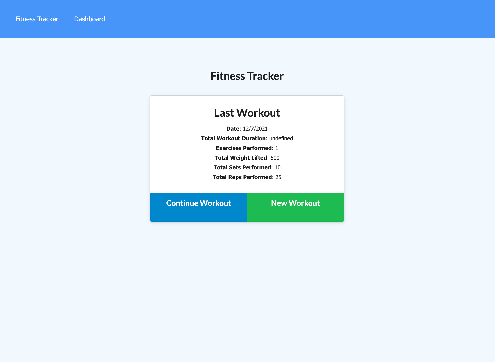
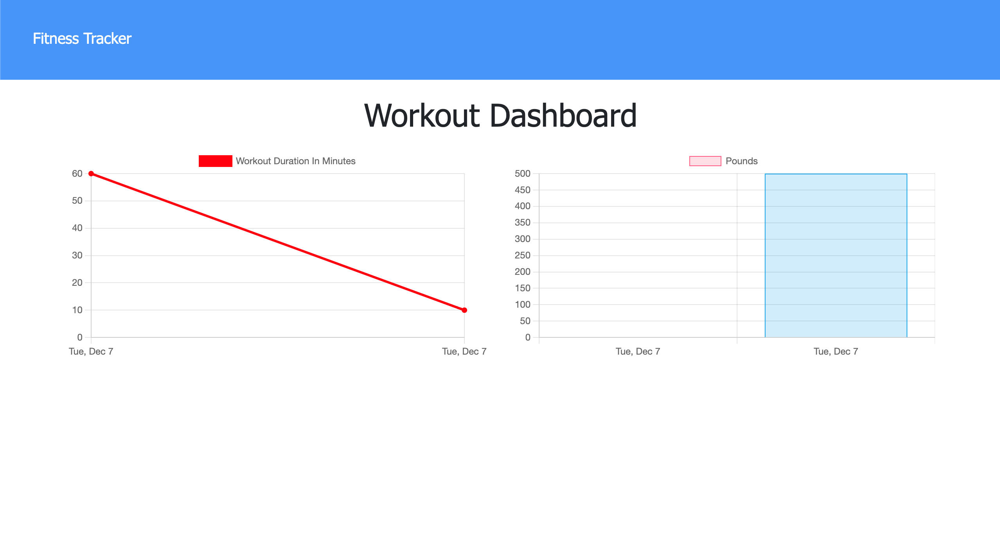

# 18-NoSQL-Fitness-Tracker

The fitness tracking application allows you to track your workouts, the goal was to create the backend of the application while retrofitting it to an exsiting frontend. 

# Table of Contents

|                               |                         |
| ----------------------------- | ----------------------- |
| [GitHub Links](#github-links) | [Questions](#questions) |
| [Test](#test)  | [License](#license)     |
| [Usage](#usage)                 | [Credits](#credits)     |
| [Usage](#usage)               |                         |

## Here is a preview of the Fitness Tracker!

# GitHub Links

Project Depoyment [Link](https://gtworkout.herokuapp.com/) 
Project Repository [Link](https://github.com/jeffcela/18-NoSQL-Fitness-Tracker)

## Questions

Please direct any questions to jeffcela@gmail.com

# Contributing

Please refer to each project's style and contribution guidelines for submitting patches and additions. In general, we follow the "fork-and-pull" Git workflow.

1. Fork the repo on GitHub
2. Clone the project to your own machine
3. Commit changes to your own branch
4. Push your work back up to your fork
5. Submit a Pull request so that we can review your changes

# Credits

_This homework assignment was completed in VS Code and Terminal by Jeff Cela_
© 2021 Trilogy Education Services, LLC, a 2U, Inc. brand. Confidential and Proprietary. All Rights Reserved.

# License

